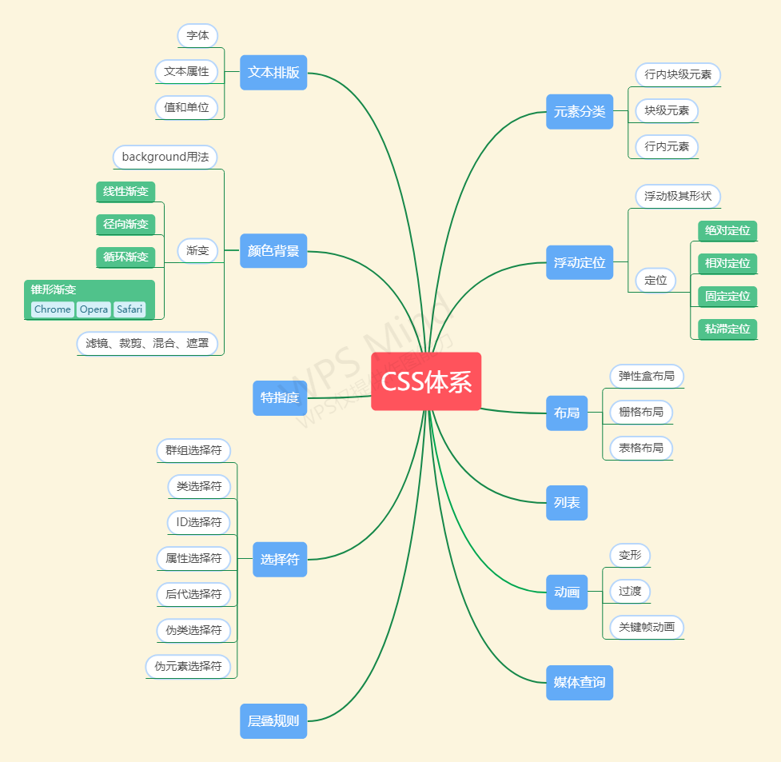

这是自己整理的一个关于CSS的相关知识的导图。这里不会详细说明每一部分的内容，而只会挑选一些可能让人迷惑的地方来说明。

## 1. 盒模型应该怎么理解？
先来复习一下盒模型的概念，摘自MDN上的关于盒模型的定义

> 当对一个文档进行布局（lay out）的时候，浏览器的渲染引擎会根据标准之一的 CSS 基础框盒模型（CSS basic box model），将所有元素表示为一个个矩形的盒子（box）。CSS 决定这些盒子的大小、位置以及属性（例如颜色、背景、边框尺寸…）。

.png)

可以看到盒模型包含了这几部分：内容区、内边距、边框、外边距。根据这四个属性，分别出现了四种盒子：content box、padding box、border box以及margin box。但是对CSS比较了解的话就可以知道，其实并没有margin box盒子，原因在于margin指的是盒子的外边距，如论我们如何设置，都是不会影响盒子区域的大小，并且margin区域的背景也是始终透明的，因此这种盒子也就没有什么实际作用了。

先来说说内容区，他是我们展示内容的区域，默认情况下，设置的width/height其实就是作用在内容区上，当然如果要使其生效，display属性就不能为`inline`值。不过这在替换元素中表现又不一样。

先来看一个🌰

```css
.image {
  width: 300px;
  padding: 10px;
  margin: 10px;
  border: 1px solid blue;
}
```

```html

```


置换元素图片的默认display属性值是`inline`，但是却能设置宽高，并且padding值也是可以显示，这和我们理解的行内元素是完全不一样的。

## 2. 继承
了解哪些属性可以继承，哪些不能继承，对于我们的编码有这非常重要的影响，很多属性，我们就可以利用继承，而不用每个元素都去声明一遍CSS属性了。

首页一般文本类的属性都是可以继承的，例如`color`，`font-size`，`font-family`等。

与之对应有些属性时不能继承的，例如`border`，`padding`，`margin`，`background`等。其实也很好理解这些属性为何不能继承，因为一旦这些属性可以继承，那么会影响到了整个布局，例如，我们在父元素上加个边框，但是其子元素，后代元素都继承了边框，那就不得不去写更多的代码来消除继承的影响，这样的结果肯定不是CSS设计的初衷。

## 3. 通用选择符的使用
所谓通用选择符，也可以称为通配符选择器，即

```css
* {
  box-sizing: border-box;
}
```
看起来非常的简单，但是滥用他会造成一些意向不到的结果。首页就是他会给所有的元素都添加上对应的属性，即使这个元素压根就用不到这个属性，这样就造成了一定的性能浪费，另外一点则是非常容易忽视的地方在于他的优先级，也是我们说的特指度，通用选择器的特指度为0，结合上面的继承来说，继承是没有特指度的，因此你如果用了通用选择符，然后指望元素通过继承获得父元素的继承属性，却会发现不起作用。来看哥🌰

```css
* {
  color: grey;
}
div#page {
  color: black;
}
```
```html
<div id="page">
  我是CSS世界的小<em>菜鸡</em>
</div>
```


很明显，最终看到的`菜鸡`是绿色的。因此这也是非常容易让人困惑的地方。

## 4. CSS的全局关键字
全局关键字就是所有的属性都能使用的属性值，总共是有三个`inherit`，`initial`，`unset`。这些关键字是CSS3才出现的，在IE11以前和Opera Mini是不支持的。

inherit 就是打破了上面的继承限制，只要属性值设置为 inherit，那么就能从父元素继承这个属性。

initial 则是将属性设置为初始值，主要是用于那些没有预定义的初始值的属性，例如 color 属性，默认是取决于用户代理，就是用户设置的某个颜色值，而设置为 initial 则会将字体颜色变成黑色。

unset 则是前两个关键字的替代，就是对于继承的属性来说，unset 就表示 inherit，而对于不继承的属性则表示 initial。

还有一个特殊属性 all 就只支持这三个关键字。all 表示除了 direction 和 unicode-bidi 之外的所有的属性。因此如果设置了 all: inherit 则表示除了上述两个属性外，其他所有的CSS属性都从其父元素继承。

## 流体布局
> 见名思意，像水流一样的布局，当河流变窄，水流也会随之变窄，这就跟使用CSS布局也是同样的道理。
### margin: auto
### max-width/min-width
## white-space
## line-height
## vertical-align